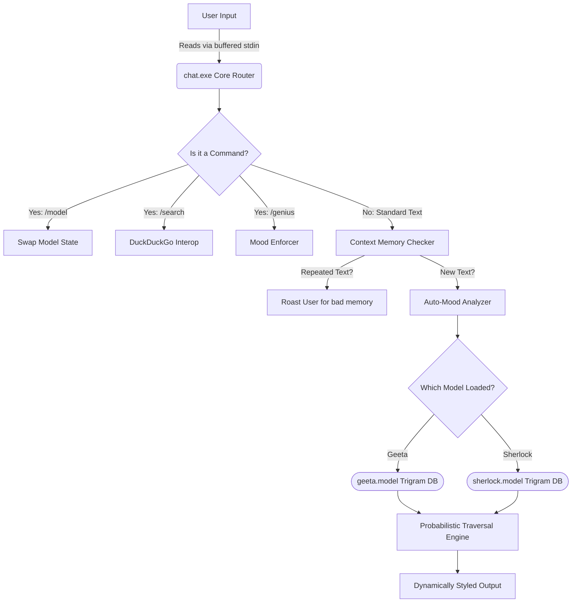

<div align="center">

# 🧠 ZigNGPT v2.0
### *Your Offline, Ultra-Fast, Sarcastic & Highly-Intelligent AI Assistant*

[](https://ziglang.org/)
[](https://opensource.org/licenses/MIT)
[](https://ziglang.org/)
[](#)

*An entirely local, extremely lightweight, zero-dependency Large Language Model orchestrator written in Zig.*

**ZigNGPT is evolving!** V1.0 brought the blazing fast local Trigram/Markov text engine. **V2.0 introduces a from-scratch Custom Neural Network Autograd Engine and full GPT Transformer Architecture**—training live locally on its own custom extracted data.

[Features](#-interactive-features) • [Installation](#-installation--quick-start) • [Commands](#-interactive-command-center) • [Architecture](#-system-architecture)

<br/>
</div>

---

## ⚡ Interactive Features

<details>
<summary><b>🎭 Dynamic Mood Engine (Click to expand)</b></summary>
<br>
ZigNGPTv1.0 actively reads the context and emotional tone of your input! It dynamically alters its personality based on <b>what you say</b>. 

- **Ask profound questions** ("why", "how") ➔ Switches to **Thoughtful** or **Genius** mood.
- **Say something silly** ➔ Automatically roasts you with **Sarcasm**.
- **Change it yourself** ➔ Use commands like `/genius` to force a logic state!
</details>

<details>
<summary><b>🌐 Built-in Web Integration & Search (Click to expand)</b></summary>
<br>
Using `/search <query>`, the AI drops into the background and uses system-level asynchronous tools (`curl`) to scrape DuckDuckGo Instant APIs. It parses the JSON data and integrates real-world internet knowledge natively without pulling massive HTTP dependencies!
</details>

<details>
<summary><b>🧠 Localized Trigram Modeling (V1 Fallback Mode) (Click to expand)</b></summary>
<br>
Using `model.zig`, ZigNGPT reads incredibly fast offline binary Markov chain files (`.model`). It maps out millions of probabilities instantly using Zig's unmanaged `HashMap` and `std.heap.page_allocator`, meaning zero latency and zero privacy concerns.
</details>

<details>
<summary><b>🔥 V2 Custom Transformer & Autograd Engine (Click to expand)</b></summary>
<br>
The new core of ZigNGPT is a completely custom-built Neural Network engine (`engine_v2/`). We implemented a pure Zig <b>Autograd</b> system that computes dynamic mathematical graphs via backpropagation. It powers a custom <b>Self-Attention Transformer Block</b> architecture built strictly on standard library math functions. Train it yourself locally on raw script files!
</details>

---

## 💾 Binaries & Corpora Data

> **Notice:** The `.bin` weight files, `.model` dumps, and massive corpus `.txt` training datasets are completely untracked from Git to prevent massive repository bloat.

- **To run V1 Trigram Models**: Generate `geeta.model` and others locally using the legacy extraction tools before booting the CLI.
- **To run the V2 Transformer**: The neural network automatically ingests `stories_corpus.txt` to continuously backpropagate parameter gradients when you launch the training script.

---

## 🏗️ System Architecture

Ever wonder how ZigNGPTv1.0 manages all this locally in under a few megabytes? Here is an interactive overview of its memory and routing logic:



---

## 🚀 Installation & Quick Start

Want to spin up your local tormentor? It's incredibly easy.

1. **Pre-requisites**: Ensure you have [Zig version 0.15.0+](https://ziglang.org/download/) installed.
2. **Build the executable** directly from source using the Zig compiler:
   ```powershell
   zig build-exe chat.zig --name chat
   ```
3. **Boot the Assistant**:
   ```powershell
   .\chat.exe
   ```

---

## 💬 Interactive Command Center

Once you've booted up the executable, you can alter its logic gates at runtime. Try copying and pasting these directly into your console!

### ⚙️ Brain Transplants (Runtime Models)
| Command | Action |
| --- | --- |
| `/model geeta` | Mounts the profound, ancient philosophical prediction engine. |
| `/model sherlock` | Mounts the analytical, hyper-perceptive detective engine. |
| `/model custom` | Falls back to your learned memory facts. |

### 🎭 Mood Modifiers
| Override | Behaviour Result |
| --- | --- |
| `/genius` | Unleashes maximum analytical capability. Highly recommended. |
| `/sarcastic` | Restores default tormentor behavior. Very mean. |
| `/thoughtful` | Makes it seriously consider your inputs before generating. |
| `/chaotic` | Unchecked logic gates. |

### 🛠️ Utilities
- 🔍 **`/search <query>`**: Ex: `/search Zig Programming Language`. Fetches Instant structural data from the web.
- 🧮 **`/math <expr>`**: Ex: `/math 50 * 50`. Solves calculations using custom stack parsers.
- 📜 **`/haiku`**: Auto-generates a procedural, never-before-seen Haiku based on currently loaded Markov chains.
- ⚔️ **`/simulate <A> <B>`**: Ex: `/simulate Socrates Nietzsche`. Instantiates two sub-models and auto-generates a philosophical debate between them.
- 🤖 **`/v2 <prompt>`**: Invokes the bleeding-edge Transformer architecture mathematically generating the next bytes of sequence!

---

<div align="center">
<i>"The software equivalent of a disappointed parent, compiled down to machine code."</i>

**[↑ Back to Top](#-zigngptv10)**
</div>
